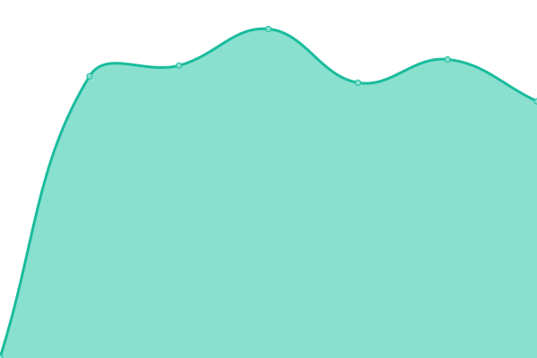

# [📈 Live Status](https://upptime.github.io/upptime): <!--live status--> **🟩 All systems operational**

This repository contains the open-source uptime monitor and status page for [Upptime](https://upptime.js.org), powered by [Upptime](https://github.com/upptime/upptime).

With [Upptime](https://upptime.js.org), you can get your own unlimited and free uptime monitor and status page, powered entirely by a GitHub repository. We use [Issues](https://github.com/upptime/upptime/issues) as incident reports, [Actions](https://github.com/ZJUICI/tablegpt-upptime/actions) as uptime monitors, and [Pages](https://upptime.github.io/upptime) for the status page.

<!--start: status pages-->
<!-- This summary is generated by Upptime (https://github.com/upptime/upptime) -->
<!-- Do not edit this manually, your changes will be overwritten -->
<!-- prettier-ignore -->
| URL | Status | History | Response Time | Uptime |
| --- | ------ | ------- | ------------- | ------ |
|  [TableGPT](https://tablegpt.zjuici.com) | 🟩 Up | [table-gpt.yml](https://github.com/ZJUICI/tablegpt-uptime/commits/HEAD/history/table-gpt.yml) | 

 1576ms
     
 | 

<a href="https://ZJUICI.github.io/tablegpt-uptime/history/table-gpt">100.00%</a>
    

|  [TableGPT-test](https://test.tablegpt.zjuici.com) | 🟩 Up | [table-gpt-test.yml](https://github.com/ZJUICI/tablegpt-uptime/commits/HEAD/history/table-gpt-test.yml) | 

 1089ms
     
 | 

<a href="https://ZJUICI.github.io/tablegpt-uptime/history/table-gpt-test">100.00%</a>
    

|  [TableGPT-slim-py](https://py-slim.tablegpt.zjuici.com) | 🟩 Up | [table-gpt-slim-py.yml](https://github.com/ZJUICI/tablegpt-uptime/commits/HEAD/history/table-gpt-slim-py.yml) | 

 1135ms
     
 | 

<a href="https://ZJUICI.github.io/tablegpt-uptime/history/table-gpt-slim-py">100.00%</a>
    

|  [Landing Page](https://welcome.tablegpt.zjuici.com/) | 🟩 Up | [landing-page.yml](https://github.com/ZJUICI/tablegpt-uptime/commits/HEAD/history/landing-page.yml) | 

 1044ms
     
 | 

<a href="https://ZJUICI.github.io/tablegpt-uptime/history/landing-page">100.00%</a>
    

<!--end: status pages-->

[**Visit our status website →**](https://upptime.github.io/upptime)

## 📄 License

- Powered by: [Upptime](https://github.com/upptime/upptime)
- Code: [MIT](./LICENSE) © [Anand Chowdhary](https://anandchowdhary.com), supported by [Pabio](https://pabio.com)
- Data in the `./history` directory: [Open Database License](https://opendatacommons.org/licenses/odbl/1-0/)
